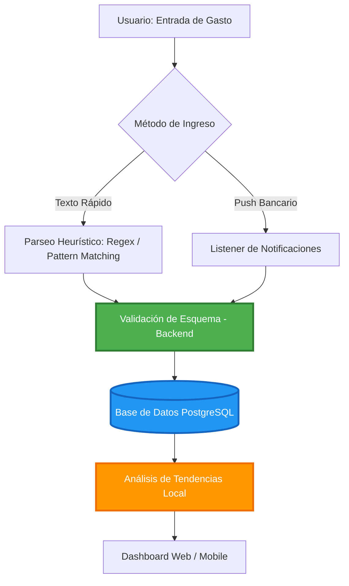

# 💸 GASTOS DIARIOS: Sistema Autónomo de Gestión Financiera y Análisis de Datos Local

  
  
  
  

---

## 🏛️ Visión del Sistema

<b>GASTOS DIARIOS</b> redefine el paradigma de la contabilidad personal mediante ingeniería recursiva. Históricamente, las aplicaciones financieras fracasan por la fricción cognitiva del ingreso manual. Este proyecto elimina esa barrera mediante una arquitectura <b>Zero-Friction</b> impulsada por lógica algorítmica avanzada y automatización local.

Más allá de un simple registro, es un <b>motor de decisiones autónomo</b>. Utilizando técnicas de parseo heurístico, reconocimiento de patrones en metadatos y modelos estadísticos locales, el sistema transforma datos crudos en estrategias de ahorro y proyecciones de capital, sin depender de servicios externos o procesamiento en la nube.

Este repositorio documenta el desarrollo integral del sistema, desde el modelado relacional hasta la implementación de arquitecturas Full-Stack, Ciberseguridad y Data Science.

## ⚙️ Funcionamiento del Ecosistema

El sistema opera bajo un flujo de automatización local diseñado para maximizar la recursividad del código:

1.  **Captura de Entrada Rápida:** El usuario ingresa datos mediante texto simplificado o comandos cortos. El sistema utiliza motores de búsqueda de patrones para identificar la intención del registro.
2.  **Motor de Procesamiento Local:** Los algoritmos de extracción desglosan campos clave (monto, comercio, categoría, fecha) y validan la información contra una base de conocimiento almacenada directamente en el dispositivo.
3.  **Persistencia y Auditoría:** Los datos se almacenan en una base de datos PostgreSQL con integridad referencial estricta, asegurando que cada centavo sea rastreable.
4.  **Modelado Estadístico:** El motor de análisis procesa los datos históricos para generar proyecciones de flujo de caja y detectar desviaciones en el presupuesto de forma determinista.

## 🌟 Ventajas Clave

*   **Reducción del Abandono:** Al eliminar la carga de llenar formularios complejos, se garantiza una mayor adherencia al hábito del registro financiero.
*   **Precisión Basada en Datos:** La automatización reduce el error humano presente en los registros manuales.
*   **Soberanía Total (Offline):** El sistema funciona sin conexión a internet y no envía datos a servidores externos, garantizando privacidad absoluta del patrimonio.
*   **Visibilidad Predictiva:** A diferencia de una app de gastos tradicional que solo mira al pasado, GASTOS DIARIOS ofrece una ventana hacia el comportamiento financiero futuro.

## 🚀 Innovaciones Tecnológicas y Diferenciadores

*   **⌨️ Motor de Parseo Heurístico:** Algoritmo optimizado para interpretar cadenas de texto y asignar automáticamente categorías mediante lógica de comparación histórica y diccionarios locales de alta eficiencia.
*   **📬 Intercepción de Metadatos:** Lógica programática para capturar y procesar notificaciones bancarias locales, automatizando el registro de transacciones en tiempo real sin intervención manual.
*   **📊 Análisis de Series Temporales Local:** Implementación de modelos estadísticos matemáticos para predecir flujos de caja e identificar "gastos hormiga" basándose en tendencias cuantitativas.
*   **🛡️ Arquitectura de Seguridad Local:** Encriptación de datos en reposo, sanitización estricta de entradas y manejo seguro de sesiones, priorizando la integridad dentro del hardware del usuario.
*   **� Ecosistema Multiplataforma (Omnichannel):** Desarrollo unificado con React Native, permitiendo despliegue simultáneo como App móvil (Android/iOS) y aplicación web/escritorio.

## 🛠️ Roadmap Pedagógico y Stack Tecnológico

El desarrollo está estructurado no solo para construir la app, sino para dominar cada tecnología subyacente.

| Fase | Objetivo Académico y Técnico | Stack Tecnológico Central | Estatus |
| :--- | :--- | :--- | :---: |
| **Fase 1** | Modelado Relacional, Integridad de Datos y SQL | PostgreSQL, DBeaver, Diseño ER | 🏗️ |
| **Fase 2** | Back End, APIs RESTful y Seguridad (JWT/CORS) | Python, FastAPI, Pydantic | 📅 |
| **Fase 3** | Lógica de Automatización, Parseo de Datos y Estadística | Python, Regex, Pandas, NumPy | 📅 |
| **Fase 4** | Front End Multiplataforma y UI/UX | React Native, Expo, TailwindCSS | 📅 |
| **Fase 5** | Despliegue, CI/CD y Publicación en PlayStore | Docker, AWS/Render, Google Play Console | 📅 |

## 📂 Arquitectura del Repositorio

- 📁 `database/`: Scripts DDL/DML, esquemas relacionales y migraciones de PostgreSQL.
- 📁 `backend_api/`: Núcleo de lógica de negocio, endpoints en FastAPI y middlewares de seguridad.
- 📁 `logic_engine/`: Algoritmos de parseo de texto, procesamiento de notificaciones y modelos estadísticos locales.
- 📁 `frontend_app/`: Código fuente de la interfaz de usuario en React Native / Expo.
- 📁 `docs/`: Documentación técnica, bitácora de aprendizaje y diagramas UML.

## 🔄 Flujo de Automatización y Registro

## 📜 LOG DE CAMBIOS IMPORTANTES (Changelog)

Mantendremos un registro estricto de nuestra evolución técnica, arquitectónica y educativa.

| Versión | Fecha | Tipo | Descripción de la Actualización |
| :--- | :--- | :---: | :--- |
| **v0.1.0** | 2024-05-22 | `INIT` | **Creación del Repositorio.** Definición de la pila tecnológica (PostgreSQL, Python/FastAPI, React Native) y diseño de la arquitectura base. |

---

  <i>"El buen código es su propia mejor documentación."</i> 
  <b>— Steve McConnell</b>

<b>© 2024 GASTOS DIARIOS Project</b>

Desarrollado y mantenido por <b>ANASKAI</b>.
