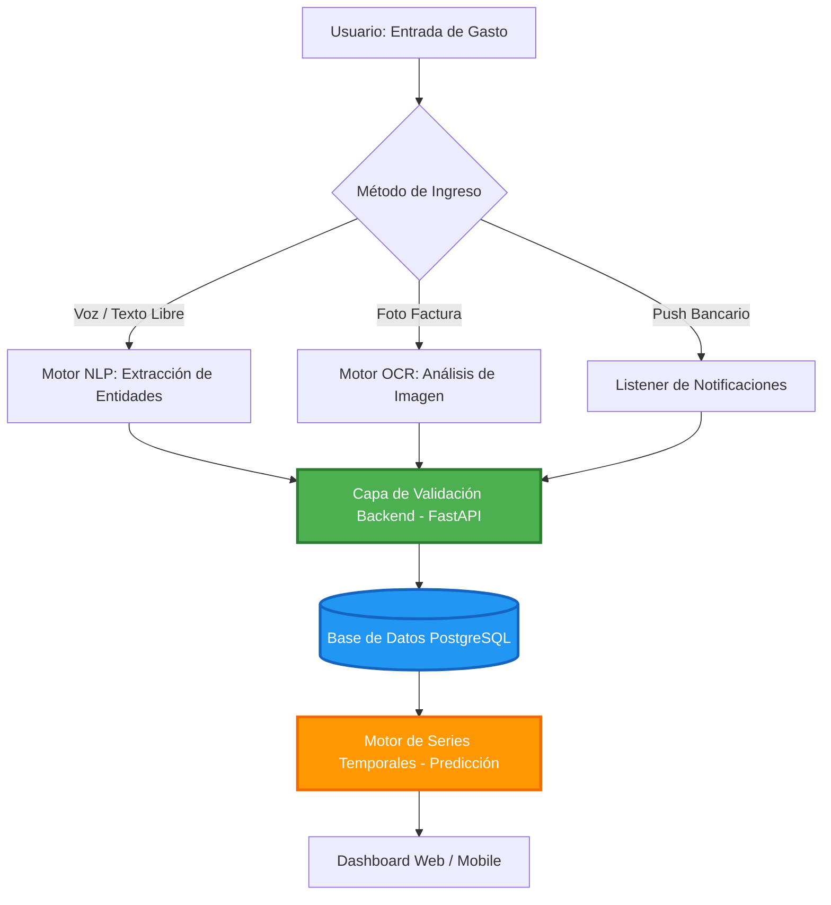

# 💸 GASTOS DIARIOS: Ecosistema Inteligente de Autonomía Financiera y Data Science

  
  
  
  

---

## 🏛️ Visión del Sistema

<b>GASTOS DIARIOS</b> redefine el paradigma de la contabilidad personal. Históricamente, las aplicaciones financieras fracasan por la fricción cognitiva que exigen al usuario (ingreso manual repetitivo de datos). Este proyecto elimina esa barrera mediante una arquitectura <b>Zero-Friction</b> impulsada por Inteligencia Artificial y automatización.

Más allá de un simple registro de ingresos y egresos, GASTOS DIARIOS es un <b>motor de decisiones financieras</b>. Mediante el uso de Procesamiento de Lenguaje Natural (NLP), lectura automatizada de metadatos (OCR y notificaciones bancarias) y modelos predictivos estadísticos, el sistema transforma datos crudos en estrategias de ahorro y proyecciones de capital. 

Este repositorio documenta el desarrollo integral del sistema, desde el modelado relacional hasta la implementación de arquitecturas Full-Stack, Ciberseguridad y Data Science.

## ⚙️ Funcionamiento del Ecosistema

El sistema opera bajo un flujo de procesamiento inteligente diseñado para minimizar la interacción manual:

1.  **Captura Omnicanal:** El usuario puede ingresar datos mediante lenguaje natural (voz o texto libre), fotografías de tickets o permitiendo que la app escuche notificaciones bancarias push.
2.  **Capa de Inteligencia (AI Layer):** Los motores de NLP y OCR extraen entidades clave (monto, comercio, categoría, fecha) y validan la información contra patrones históricos.
3.  **Persistencia y Auditoría:** Los datos se almacenan en una base de datos PostgreSQL con integridad referencial estricta, asegurando que cada centavo sea rastreable.
4.  **Análisis Predictivo:** El motor estadístico procesa los datos históricos para generar proyecciones de flujo de caja y detectar anomalías en el comportamiento de gasto.

## 🌟 Ventajas Clave

*   **Reducción del Abandono:** Al eliminar la carga de llenar formularios complejos, se garantiza una mayor adherencia al hábito del registro financiero.
*   **Precisión Basada en Datos:** La automatización reduce el error humano presente en los registros manuales.
*   **Privacidad de Grado Bancario:** El sistema prioriza la seguridad local y la encriptación de datos sensibles, manteniendo la soberanía financiera del usuario.
*   **Visibilidad Predictiva:** A diferencia de una app de gastos tradicional que solo mira al pasado, GASTOS DIARIOS ofrece una ventana hacia el comportamiento financiero futuro.

## 🚀 Innovaciones Tecnológicas y Diferenciadores

*   **🎙️ Procesamiento de Lenguaje Natural (NLP):** Módulo de entrada inteligente que interpreta texto y voz (ej. *"Ayer gasté 45 mil en gasolina"*), extrayendo automáticamente el monto, la categoría y la marca temporal para un registro sin fricción.
*   **👁️ Extracción Óptica de Datos (OCR) y Sincronización:** Capacidad para digitalizar recibos mediante visión computacional e intercepción segura de notificaciones bancarias (Push/SMS), garantizando la integridad de los datos en tiempo real.
*   **📊 Motor de Inferencia Estadística y Forecasting:** Implementación de algoritmos de series temporales para predecir flujos de caja futuros, identificar fugas de capital ocultas ("gastos hormiga") y optimizar metas de ahorro dinámicas.
*   **🛡️ Arquitectura de Ciberseguridad Robusta:** Encriptación de extremo a extremo (E2EE), sanitización de inputs y manejo seguro de tokens de sesión (JWT), asegurando la privacidad de la información financiera bajo estándares de la industria.
*   **📱 Ecosistema Multiplataforma (Omnichannel):** Desarrollo unificado con React Native, permitiendo despliegue simultáneo como App móvil (Android/iOS) y aplicación web/escritorio.

## 🛠️ Roadmap Pedagógico y Stack Tecnológico

El desarrollo está estructurado no solo para construir la app, sino para dominar cada tecnología subyacente.

| Fase | Objetivo Académico y Técnico | Stack Tecnológico Central | Estatus |
| :--- | :--- | :--- | :---: |
| **Fase 1** | Modelado Relacional, Integridad de Datos y SQL | PostgreSQL, DBeaver, Diseño ER | 🏗️ |
| **Fase 2** | Back End, APIs RESTful y Seguridad (JWT/CORS) | Python, FastAPI, Pydantic | 📅 |
| **Fase 3** | Lógica de IA, NLP, OCR y Modelos Predictivos | Python, SpaCy, Tesseract, Scikit-learn | 📅 |
| **Fase 4** | Front End Multiplataforma y UI/UX | React Native, Expo, TailwindCSS | 📅 |
| **Fase 5** | Despliegue, CI/CD y Publicación en PlayStore | Docker, AWS/Render, Google Play Console | 📅 |

## 📂 Arquitectura del Repositorio

- 📁 `database/`: Scripts DDL/DML, esquemas relacionales y migraciones de PostgreSQL.
- 📁 `backend_api/`: Núcleo de lógica de negocio, endpoints en FastAPI y middlewares de seguridad.
- 📁 `ai_engine/`: Scripts de procesamiento de lenguaje natural, OCR y modelos estadísticos.
- 📁 `frontend_app/`: Código fuente de la interfaz de usuario en React Native / Expo.
- 📁 `docs/`: Documentación técnica, bitácora de aprendizaje y diagramas UML.

## 🔄 Flujo de Automatización y Registro

## 📜 LOG DE CAMBIOS IMPORTANTES (Changelog)

Mantendremos un registro estricto de nuestra evolución técnica, arquitectónica y educativa.

| Versión | Fecha | Tipo | Descripción de la Actualización |
| :--- | :--- | :---: | :--- |
| **v0.1.0** | 2024-05-22 | `INIT` | **Creación del Repositorio.** Definición de la pila tecnológica (PostgreSQL, Python/FastAPI, React Native) y diseño de la arquitectura base. |

---

  <i>"El buen código es su propia mejor documentación."</i> 
  <b>— Steve McConnell</b>

<b>© 2024 GASTOS DIARIOS Project</b>
